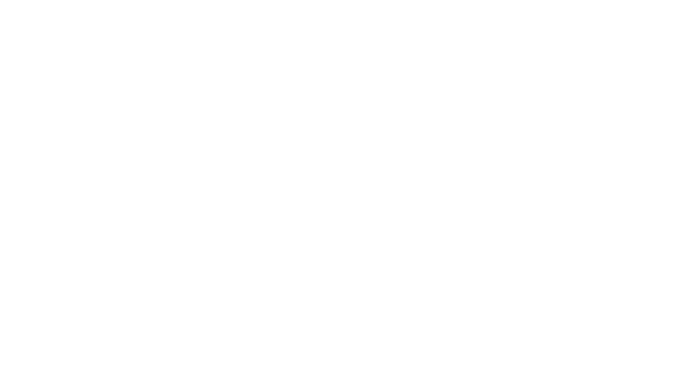

## This is the legacy of the Baber Mahal Vilas website. The website is no longer live. This repository is for reference only.

## Description

The vision behind the boutique property is to create a hospitality model where in, luxury and service are provided in a historically and culturally significant ambience in the center Kathmandu Valley. To host our guests in an atmosphere that illustrates the grand lifestyle of the Rana era mixed with the original architectural heritage of Newar, Mustang and Terai cultures. Though modest in size the property is attached to BABER MAHAL REVISITED complex. Acting as an extension to the Vilas, Revisited offers a host of shops offering quality traditional products, and some of the finest dining options in the city.

## Technologies Used

- HTML
- Tailwind CSS
- JavaScript
- jQuery
<!-- - AOS Library (Animation on Scroll) -->
- Php

## Development

To set up the project locally, follow these steps:

1. Clone the repository:

   ```bash
   git clone https://github.com/username/repo.git

2. Open `index.html` in your browser or set up a local development server.


<!-- ## Credits
- Author: Longtail e-media -->
